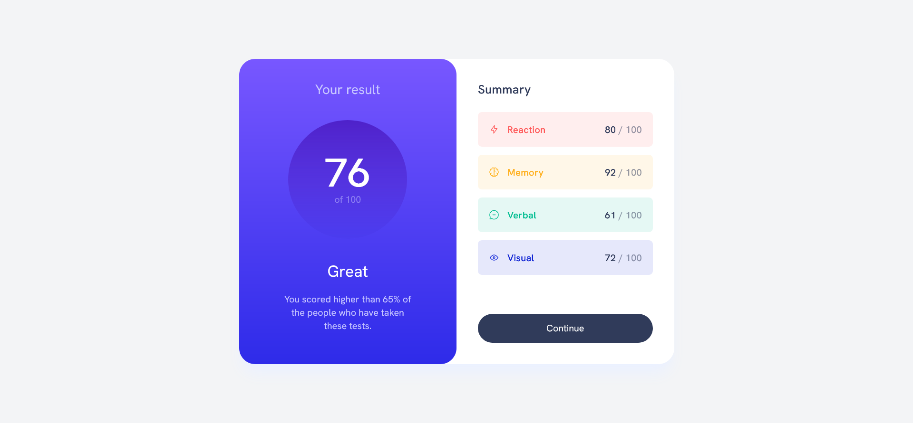
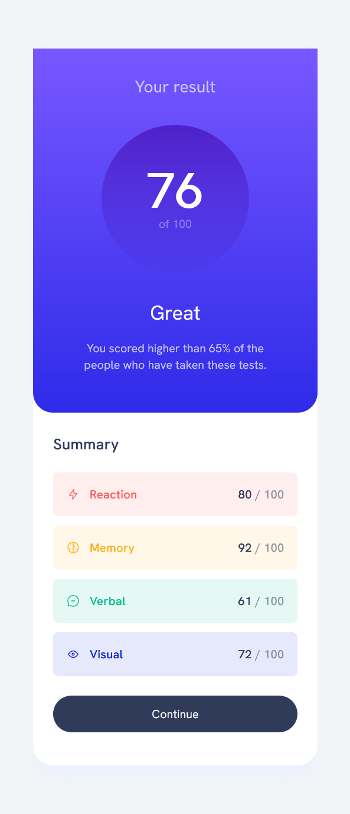

# Frontend Mentor - Results summary component solution

This is a solution to the [Results summary component challenge on Frontend Mentor](https://www.frontendmentor.io/challenges/results-summary-component-CE_K6s0maV). Frontend Mentor challenges help you improve your coding skills by building realistic projects. 

## Table of contents

- [Frontend Mentor - Results summary component solution](#frontend-mentor---results-summary-component-solution)
  - [Table of contents](#table-of-contents)
  - [Overview](#overview)
    - [The challenge](#the-challenge)
    - [Screenshot](#screenshot)
    - [Mobile screenshot](#mobile-screenshot)
    - [Built with](#built-with)
    - [Running the project](#running-the-project)

## Overview

### The challenge

Users should be able to:

- View the optimal layout for the interface depending on their device's screen size
- See hover and focus states for all interactive elements on the page

### Screenshot

### Mobile screenshot

### Built with

- Semantic HTML5 markup
- Flexbox
- [Vue.js](https://vuejs.org/) - JS library
- [Tailwindcss](https://tailwindcss.com/) - utility-first CSS framework

### Running the project

`npm install`

`npm run dev`